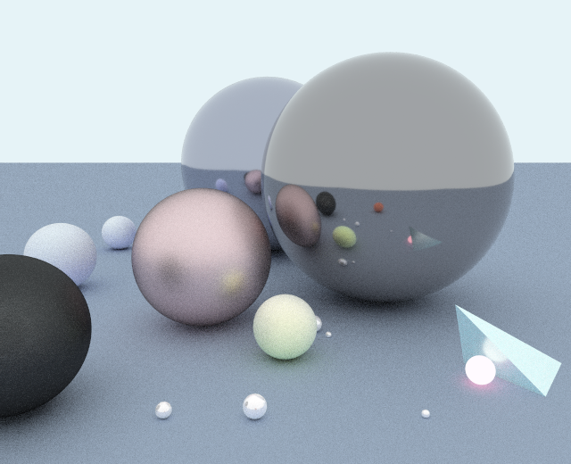

# CSE230-Final-Path-Tracer

# Update

## Architecture 

We have a **scene parser** to load our [scene files](Scene/scene3.test). We also wrote a **transform library** to provide transformation operation, such as calcualte translation, scale, and rotation matrix.

The rendering part are mainly made up by three modules. Those modules have been completed.

1. **Primitive module.** This library defines the type of ray, triangle and sphere, and the ray-triangle/ray-sphere collision detection algorithm. Also, a bounding volume hierarchy (BVH) tree is implemented to speedup the collision algorithm, which also includes a ray-cube collision dection algorithm.

2. **Renderer module.** The renderer is who manipulates the image array. The renderer will calculate how to generate correct rays for each pixels based on the camera, and call the collision detection algorithms to check if the ray missed or collided with an object. An anti-aliasing algorithm is also implemented in this module.

3. **Shader module.** After the renderer module determine the position of the collision and the normal of the surface, the shader module will be called to detemine the correct color for the corresponding pixel by evaluating the rendering equation. The shader module itself will also shoot rays and call the shader module recursively in order to perform the global illumination.

We will also have a **post-processing module** to perform some simple denoising algorithm.

## Challenges

The most significant problem is performance. Before using parallel computing, We tried only serial computing i.e. calculating the RGB value pixel by pixel and rendering a 300x200 image with 20 samples costs around 20 minutes, which is unacceptable. There are two solutions, and we implement them both. The first one is to implement an acceleration structure. We implemented the BVH tree, which significantly reduced the number of required ray-object intersection tests. The second one is to implement the render with multiple threads. We take advantage of Repa library, which allows us to fill in the array in parallel.

After implementing those methods, we can render a 640x480 image with 128 samples within 2 minutes.

## Progress Evaluation

The project is almost finished. The last part to do is the post-processing algorithm, and some formal unit testing. Besides those, everything has been completed. Here is an image rendered by our path tracer.

## Dependencies

1. [JuicyPixels](https://hackage.haskell.org/package/JuicyPixels) used to input/output images
2. [Repa](https://hackage.haskell.org/package/repa) used to create a 3D-array (width by height by RGBA) representing the image structure. This library is also used to perform paralle computing.
3. [Linear](https://hackage.haskell.org/package/linear) is a linear algebra to perform vector-matrix operations.
4. [Mersenne](https://hackage.haskell.org/package/mersenne-random-pure64) is used to get pseudo-random numbers. This library provides a pure function to generate random numbers.

# Goal

In this project, we will implement a ray tracing system in Haskell (specifically, a [path tracer](https://en.wikipedia.org/wiki/Path_tracing)) from scratch. After finishing this project, we expect that we can render some photorealistic images using Haskell. This project will include three parts:

## IO System

A parser will be written to support reading scene files. The scene files will usually contain the shape information such as the locations of triangles surfaces and spheres, lighting parameters, and other rendering options. We will use an image library to read textures and output result images.

## Path Tracing Algorithm

The path tracing algorithm will include two parts:

### Ray-primitive Collision Detection

We will implement ray-triangle and ray-sphere collision detection algorithms. To improve the performance, we will also implement a bounding volume hierarchy (BVH) tree.

### Shading and rendering equation

We will build several data types such as triangles, spheres, rays, lights, and cameras to construct the shading algorithm.

We expect to implement the [GGX rendering equation](https://www.cs.cornell.edu/~srm/publications/EGSR07-btdf.pdf). We will use the Monte Carlo integration to evaluate the equation. After calculating the rendering equation, we can get the RGB value for each pixel on the image. 

If time allows, We can also implement texture mapping and make our system support texturing.

## Post-processing Algorithms

We will implement some filters such as median filter and gaussian filter to denoise the output to get better images. If time allows, some other advanced denoising algorithm may also be implemented.

## Expected Dependencies

We will not use any pre-built computer graphics libraries. We expect only to use a vector-matrix operation library and an image library used to input/output images.
